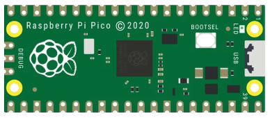
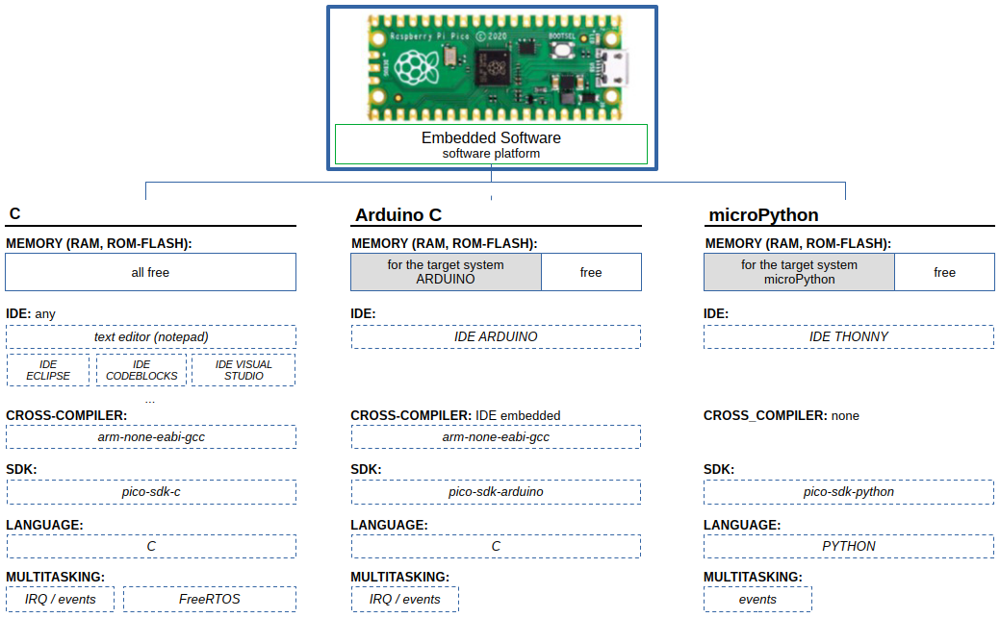

# examples-raspberry-pi

This repository contains source code of Embedded Control Programs and User Applications (as Examples) for Raspberry Pi platforms.

## Raspberry Pi Pico

(ARM Cortex-M0+ 32-bit, Dual-Core)

### Hardware Platform

- RPi Pico 2040
  - ARM Cortex-M0+ 32-bit RISC, Dual-Core
  - System Clock 133 MHz
  - FLASH 2 MB
  - SRAM 264 kB
  - GPIO 26x
  - ADC 1x 12-bit 4-channels
  - Timer 1x
  - RTC 1x
  - UART 2x
  - SPI 2x
  - I2C 2x
  - USB 1.1 Device/Host 1x
  - SWD 1x
  - Temperature sensor 1x (built-in, analog, connected to ADC.Ch4)

### Software Platform

### Rersources

- C
  - [PICO-SDK-C: Source code](https://github.com/raspberrypi/pico-sdk)
  - [PICO-SDK-C: DoxyGen](https://www.raspberrypi.com/documentation/pico-sdk/)
  - [PICO-SDK-C: Examples](https://github.com/raspberrypi/pico-examples)
  - [FreeRTOS: Source code](https://github.com/FreeRTOS/FreeRTOS-Kernel)
  - [FreeRTOS: SMP - Intro](https://www.freertos.org/Documentation/02-Kernel/02-Kernel-features/13-Symmetric-multiprocessing-introduction)
  - [FreeRTOS: AMP - Core to Core communications](https://www.freertos.org/Community/Blogs/2020/simple-multicore-core-to-core-communication-using-freertos-message-buffers)
  - [FreeRTOS: SMP - Demo 1](https://embeddedcomputing.com/technology/open-source/linux-freertos-related/using-freertos-with-the-raspberry-pi-pico-part-4)
  - [FreeRTOS: SMP - Demo 2](https://mcuoneclipse.com/2023/12/29/multi-core-symmetric-multi-processing-smp-with-freertos/)
  - [FreeRTOS: Demos](https://freertos.org/smp-demos-for-the-raspberry-pi-pico-board.html)
- microPython
  - [micropython](https://github.com/micropython/micropython)
  - [micropython examples](https://github.com/raspberrypi/pico-micropython-examples)
  - [thonny.org](https://thonny.org)
  - [thonny ginhub](https://github.com/thonny/thonny/releases)
