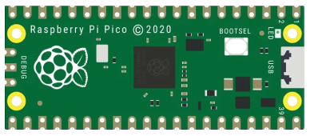

# examples-raspberry-pi

This repository contains source code of Embedded Control Programs and User Applications (as Examples) for Raspberry Pi platforms.

## Raspberry Pi Pico

(ARM Cortex-M0+ 32-bit, Dual-Core)

### Hardware Platform

- RPi Pico 2020

### Software Platform

- Embedded SDK (firmware)
  - micro-Python
- IDE
  - Thonny 3.3.13
- Language
  - Python 3

## Rersources

- [micropython](https://github.com/micropython/micropython)
- [micropython examples](https://github.com/raspberrypi/pico-micropython-examples)
- [thonny.org](https://thonny.org)
- [thonny ginhub](https://github.com/thonny/thonny/releases)
- [freertos](https://freertos.org/symmetric-multiprocessing-introduction.html)
- [freertos demos](https://freertos.org/smp-demos-for-the-raspberry-pi-pico-board.html)
