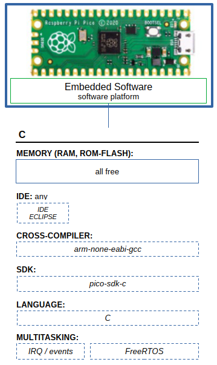

# examples-raspberry-pi

## PICO-SDK-C

- IDE
  - Eclipse
- CROSS-COMPILER
  - arm-none-eabi-gcc
- SDK
  - pico-sdk-c
- LANGUAGE
  - C
- MULTITASKING
  - IRQ / events
  - FreeRTOS

### Examples

IDE Eclipsó pre-configured workspace
- **pico-freertos** - FreeRTOS includes (source code)
- **pico-sdk** - PICO-SDK C / HAL - Hardware Abstract Layer (source code)
- **pico-tools** - external build tools (elf2uf2, debug, ...)
- **rp2040-c-led-blink** - example project (source code)
- **rp2040-c-uart** - example project (source code)
- **rp2040-c-rtc** - example project (source code)
- **rp2040-c-freertos-smp-dualcore** - example project (source code)
- **rp2040-c-freertos-smp-dualcore-affinity** - example project (source code)
