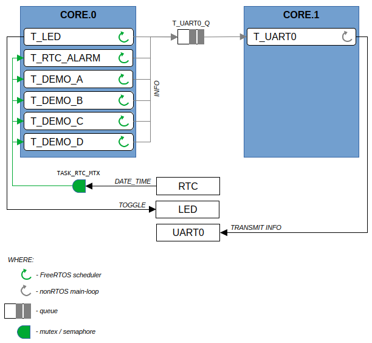

# examples-raspberry-pi

## Raspberry Pi Pico

### Hardware Platform

- RPi Pico 2040
  - ARM Cortex-M0+ 32-bit RISC, Dual-Core
  - System Clock 133 MHz
  - FLASH 2 MB
  - SRAM 264 kB
  - GPIO 26x
  - ADC 1x 12-bit 4-channels
  - Timer 1x
  - RTC 1x
  - UART 2x
  - SPI 2x
  - I2C 2x
  - USB 1.1 Device/Host 1x
  - SWD 1x
  - Temperature sensor 1x (built-in, analog, connected to ADC.Ch4)

### Software Platform

- Embedded SDK (firmware)
  - pico-sdk-c
- IDE
  - Eclipse / GCC-ARM-NONE-EABI
- Language
  - C
- RTOS
  - FreeRTOS-KernelV11.1.0 (SMP is supported)

## Example: rp2040-c-freertos-amp
LED + UART + RTC + AMP (Asymmetric Multiprocessing: RTOS and nonRTOS)

Tasks:
- T_LED
  - blocked (waiting for end of delay)
  - LED.toggle and send the task-info info UART0.Queue
  - CORE.0 - FreeRTOS
- T_DEMO_A
  - blocked (waiting for end of delay)
  - send the task-info info TASK_UART0_Q
  - CORE.0 - FreeRTOS
- T_DEMO_B
  - blocked (waiting for end of delay)
  - send the task-info info TASK_UART0_Q
  - CORE.0 - FreeRTOS
- T_DEMO_C
  - blocked (waiting for end of delay)
  - send the task-info info TASK_UART0_Q
  - CORE.0 - FreeRTOS
- T_DEMO_D
  - blocked (waiting for end of delay)
  - send the task-info info TASK_UART0_Q
  - CORE.0 - FreeRTOS
- T_RTC_ALARM
  - hardware IRQ / event
  - send the task-info info TASK_UART0_Q
  - CORE.0 - FreeRTOS
- T_UART0
  - blocked (waiting for message in TASK_UART0_Q)
  - read TASK_UART0_Q and print received task-info
  - CORE.1 - nonRTOS

Each task send the info into UART0:
- current datetime from RTC
- its name
- the core (0, 1) that it is currently running on

Shared resources:
- Multi-core
  - thread-safe communication via nonRTOS-queue (TASK_UART0_Q)
- RTC.datetime
  - thread-safe access via RTOS-mutex/semaphore (TASK_RTC_MTX)
