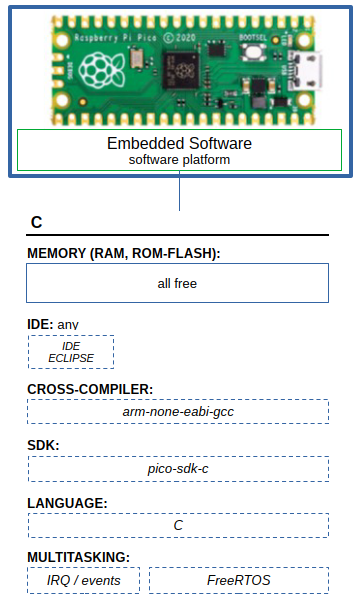

# Raspberry Pi Pico

# sdk-c
SDK C: source code, examples

### RPICO

**Hardware Platform**

- MCU RP2040
  - ARM Cortex-M0+ 32-bit RISC, Dual-Core
  - System Clock 133 MHz
  - FLASH 2 MB
  - SRAM 264 kB
  - GPIO 26x
  - ADC 1x 12-bit 4-channels
  - Timer 1x
  - RTC 1x
  - UART 2x
  - SPI 2x
  - I2C 2x
  - USB 1.1 Device/Host 1x
  - SWD 1x
  - Temperature sensor 1x (built-in, analog, connected to ADC.Ch4)

**Software Platform**

- Embedded SDK (firmware)
  - pico-sdk-c
- IDE
  - Eclipse + cross-compiler gcc-arm-none-eabi
- Language
  - C
- Frameworks, External libraries and tools
  - FreeRTOS-KernelV11.1.0 (with SMP)
  - elf2uf2 (elf to uf2 converter)

## Example: rp2040-c-uart
LED + UART (nonRTOS - BareMetal)

- Main function
  - LED init
  - UART0 init
  - main cycle

- Main cycle
  - execute UART0 task
  - execute LED task

- UART0 task
  - print init-information (on first execution)
  - print constant string "TASK.UART"

- LED task
  - LED toggle
  - sleep on PLC_LED_USER_BLINK_PERIOD
