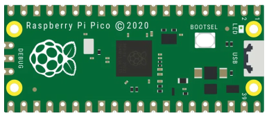
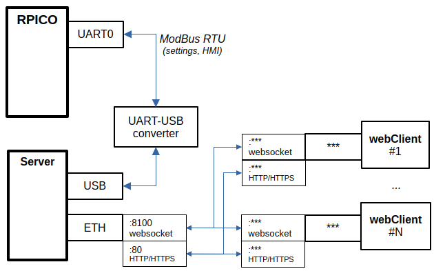
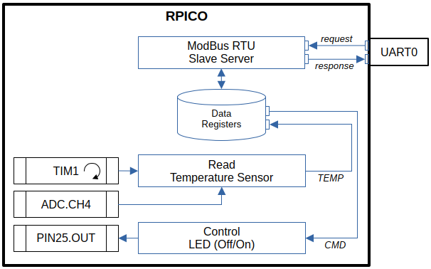
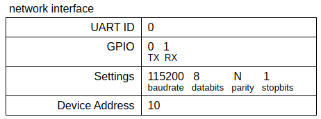
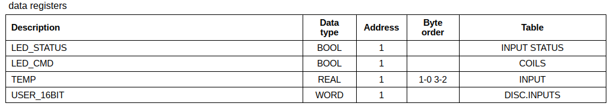
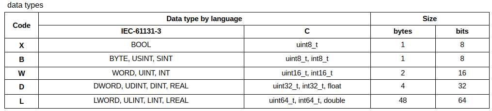
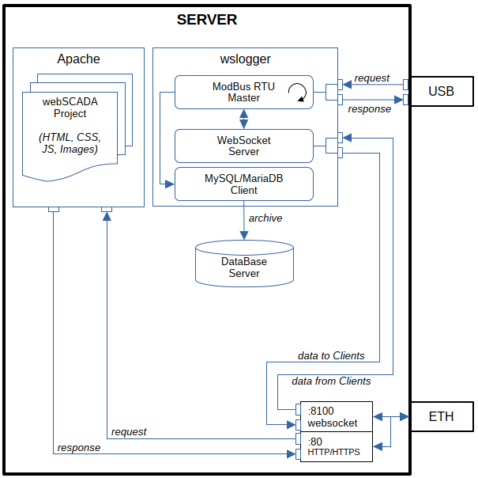

# Raspberry Pi Pico

## sdk-python
SDK Python: source code, example

### RPICO

**Hardware Platform**

- MCU RP2040
  - ARM Cortex-M0+ 32-bit RISC, Dual-Core
  - System Clock 133 MHz
  - FLASH 2 MB
  - SRAM 264 kB
  - GPIO 26x
  - ADC 1x 12-bit 4-channels
  - Timer 1x
  - RTC 1x
  - UART 2x
  - SPI 2x
  - I2C 2x
  - USB 1.1 Device/Host 1x
  - SWD 1x
  - Temperature sensor 1x (built-in, analog, connected to ADC.Ch4)

**Software Platform**

- Embedded SDK (firmware)
  - micro-Python (rp2-pico-20230426-v1.20.0.uf2)
- IDE
  - Thonny 3.3.13
- Language
  - Python 3
- Frameworks, External libraries
  - umodbus

### WebSocket Server (Logger)

**Hardware Platform**

- Desktop, Server or Single Board PC (ex. RPi 2/3/4)
  - 1xUSB, 1xLAN (Ethernet)

**Software Platform**

- OS
  - Windows, Linux
- Frameworks
  - Qt5

### WebSocket Client

**Hardware Platform**

- Desktop, LapTop, SmartPhone or Tablet
  - 1xLAN (Ethernet)

**Software Platform**

- OS
  - any
- Web-browser
  - any
- Frameworks
  - HTML5, CSS, jQuery UI Mobile

### Example: ModBus RTU Slave Server, WebSocket SCADA

**CORE-0**

- Init. Periphery
  - ModBus Slave Server
    - UART0
      - spd: 115200 N 8 1
      - net.addr: 10
    - registers
      - dictionary DEV_MODBUS_REGS
    - TIM1
      - periodic mode
      - freq. 1 sec
    - LED
      - PIN25
      - OUT mode
      - turn-off by default
- Main task (infinite loop)
  - ModBus Slave Server process
- TIM1.tick (handler-function)
  - read value of temperature sensor built-in the controller (used ADC.Ch4)
  - write the value into INPT-register of the ModBus Slave Server

