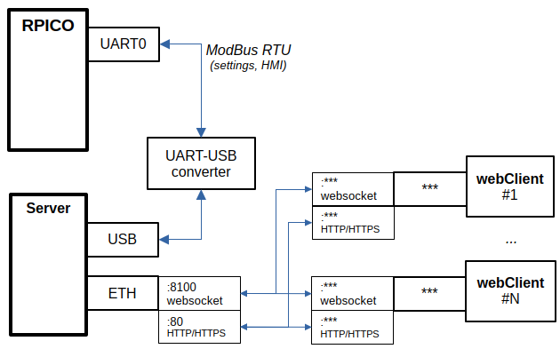
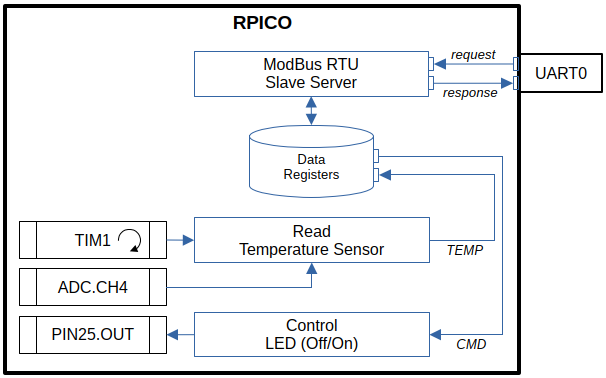
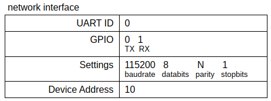
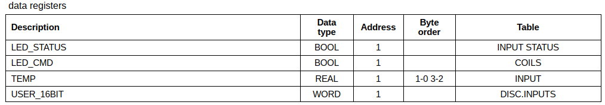
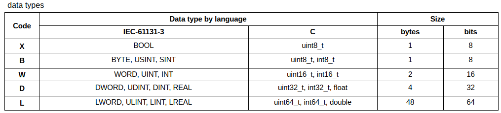
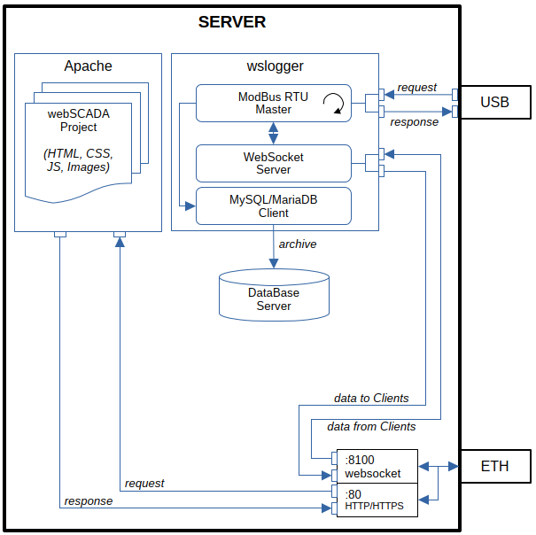

# examples-raspberry-pi

## Raspberry Pi Pico

### Hardware Platform

- RPi Pico 2020
  - ARM Cortex-M0+ 32-bit RISC, Dual-Core
  - System Clock 133 MHz
  - FLASH 2 MB
  - SRAM 264 kB
  - GPIO 26x
  - ADC 1x 12-bit 4-channels
  - Timer 1x
  - RTC 1x
  - UART 2x
  - SPI 2x
  - I2C 2x
  - USB 1.1 Device/Host 1x
  - SWD 1x
  - Temperature sensor 1x (built-in, analog, connected to ADC.Ch4)

### Software Platform

- Embedded SDK (firmware)
  - micro-Python (rp2-pico-20230426-v1.20.0.uf2)
- IDE
  - Thonny 3.3.13
- Language
  - Python 3
- Frameworks, External libraries
  - umodbus

## WebSocket SCADA

### Hardware Platform

- Server
  - Desktop, Server, Single Board PC (ex. RPi 2/3/4)
  - 1xUSB, 1xLAN (Ethernet)
- Client
  - Desktop, LapTop, SmartPhone, Tablet
  - 1xLAN (Ethernet)

### Software Platform

- Server
  - Windows, Linux
  - Qt5
- Client
  - Any OS
  - web-browser
  - HTML5, CSS, JavaScript

## rpico-modbus-rtu-websocket-scada

Example: ModBus RTU Slave Server, WebSocket SCADA.

### CORE-0

**Init. Periphery**

- ModBus Slave Server
  - UART0
    - spd: 115200 N 8 1
    - net.addr: 10
  - registers
    - dictionary DEV_MODBUS_REGS
- TIM1
  - periodic mode
  - freq. 1 sec
- LED
  - PIN25
    - OUT mode
    - turn-off by default

**Main task**

(infinite loop)

- ModBus Slave Server process

**TIM1.tick handler-function**

- Read value of temperature sensor built-in the controller (used ADC.Ch4)
- Write the value into INPT-register of the ModBus Slave Server

